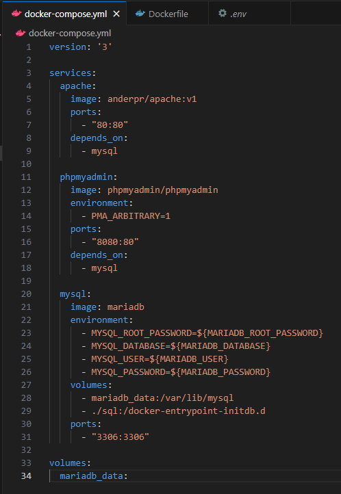
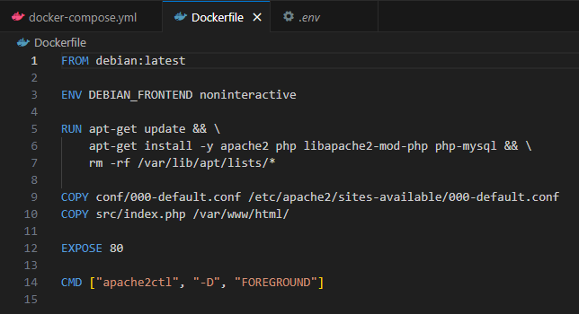
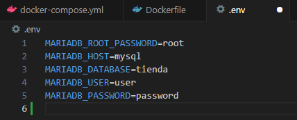
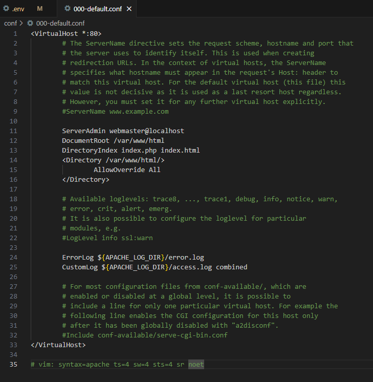
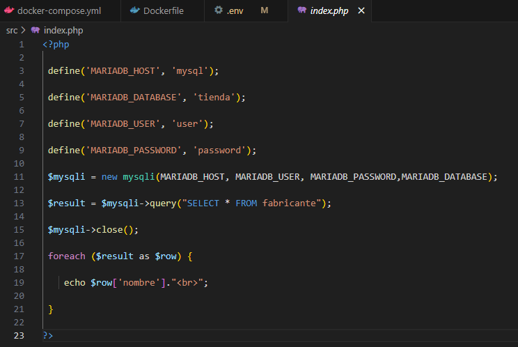
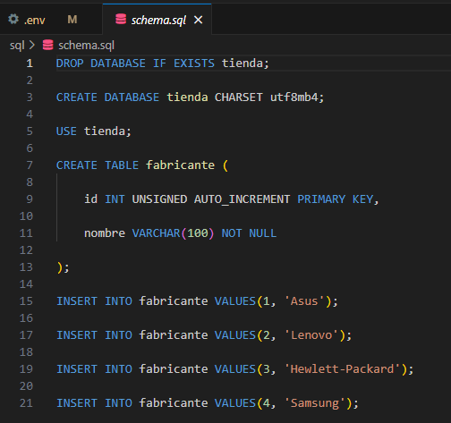
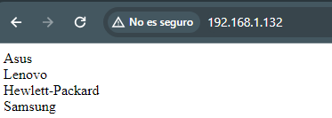
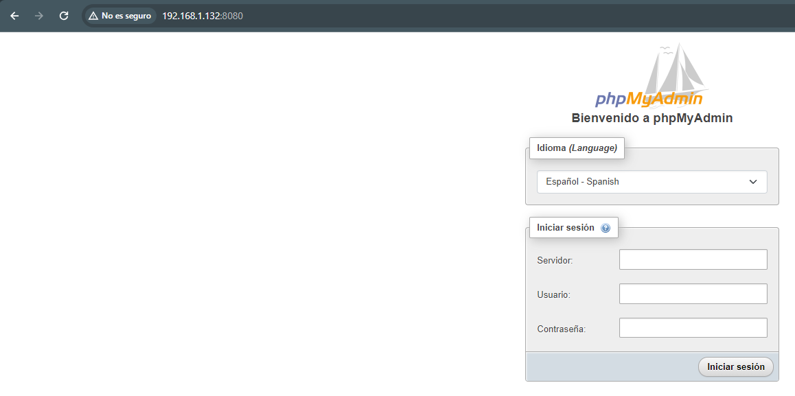

# actividad13_lamp_dockers
## Ander Pelayo Remesal

1. En este apartado lo que tenemos que hacer es un LAMP dentro de docker, para esto lo que haremos sera una imagen de apache para ello usaremos el comando que veremos a continuacion `docker build -t anderpr/apache:v1 .` Con este creamos la imagen que posteriormente meteremos en el archivo de Docker-compose.yml este documento quedaria de la siguiente forma   

   

2. El siguiente documento que crearemos es el dockerfile, este archivo nos quedaria de la siguiente forma   

   

3. Ahora vamos a crar los documentos .env, 000-default.conf, index.php y schema.sql estos archivos nos los facilita el profesora en el enunciado de la tarea menos el 000-default.conf que le copiaremos de apartados anteriores, estos documetos quedarian de la siguiente manera   

   

   

   

   

4. Ahora solo faltaria ejecutar el docker con el siguiente comando `docker compose up` ejecutado este comando nos dirigiremos al navegadore y podremos la IP, si no ponemos ningun puerto nos tendria que salir el index.php y si ponemos el puerto 8080 nos tendria que salir el PHPmyAdmin como vemos a continuacion   

   

Con esto terminariamos este apartado.